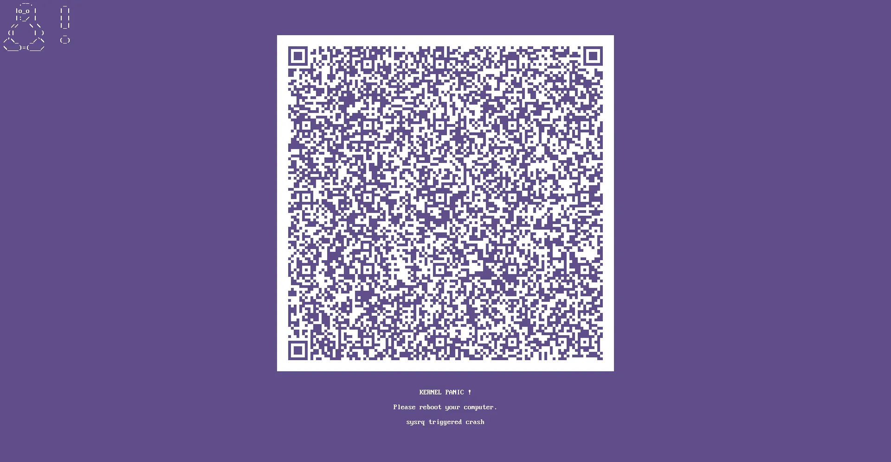

[kernel panic][kernel-panic]

Alright, buckle up, buttercups, because I've got a tale of digital woe, unexpected heroism from trusty tools, and a Linux box that decided to give me the silent treatment – or rather, the very LOUD "Kernel Panic" treatment. This is the story of how my `/boot` partition went on a diet, choked, and how I (eventually) nursed it back to health, learning a ton along the way.

## The Day My Linux Desktop Decided to Play Dead

It all started with a seemingly innocent desire: to add the LTS (Long Term Support) kernel to my Arch Linux setup. You know, for stability, for options, for the sheer geeky joy of having more than one kernel. Arch Linux, being the wonderfully flexible beast it is, makes this pretty straightforward. Or so I thought.

After the `pacman -S linux-lts linux-lts-headers` command did its thing, I rebooted, anticipating a new entry in my GRUB menu. Instead, I was greeted by a cascade of text, culminating in the dreaded **Kernel Panic**. My screen froze, my heart sank. "Not an OS crash!" I lamented, "This is a *Linux* screen of death!"

### Why Bother With Multiple Kernels Anyway?

Now, you might be asking, "Why complicate life with more than one kernel?" Great question! On a rolling release distro like Arch, having multiple kernels is like having a safety net and a playground rolled into one:

1.  **The Stable Workhorse:** This is your main kernel (e.g., `linux`). It's got the latest features and drivers. Usually, it's rock solid.
2.  **The LTS (Long Term Support) Kernel:** This one (e.g., `linux-lts`) is updated less frequently, focusing on stability and security fixes over a longer period. If a new mainline kernel introduces a bug that affects your hardware, you can boot into the LTS kernel and keep working while the issue gets sorted. It's your "old reliable."
3.  **Testing/Specific Kernels (Optional):** Sometimes you might want to try a testing kernel, a kernel optimized for a specific task (like `linux-zen` for desktop responsiveness), or even compile your own!

Essentially, it's about choice, resilience, and sometimes, troubleshooting. My mistake? Not giving these kernels enough room to, well, *exist*.

## The Culprit: A Cramped `/boot` Partition

After some head-scratching and booting into a live USB, the villain of our story became clear: my `/boot` partition was stuffed to the gills. I had allocated a measly 200MB to it during the initial installation. "Plenty," I'd thought. Famous last words.

### What's Eating All That Space in `/boot`?

The `/boot` partition is critical. It holds the files necessary to get your system up and running before your main root filesystem is even touched. The main space hogs are typically:

* **Kernel Images (`vmlinuz-linux`, `vmlinuz-linux-lts`, etc.):** These are the actual Linux kernels. They're compressed, but they still take up space (tens of MBs each).
* **Initramfs Images (`initramfs-linux.img`, `initramfs-linux-lts.img`):** This is the **Initial RAM Filesystem**. It's a small, temporary root filesystem loaded into memory. Its job is crucial: it contains modules and scripts needed to mount your *actual* root filesystem, especially if it's encrypted (like mine with LUKS) or on a complex storage setup (RAID, LVM). These can be surprisingly chunky, often larger than the kernel image itself, especially if you have lots of hardware or features enabled. Adding a second kernel means adding a second, equally large, initramfs image.
* **Microcode Updates (`intel-ucode.img`, `amd-ucode.img`):** Processor microcode that gets loaded early. Smaller, but they add up.
* **GRUB Configuration and EFI files:** If `/boot` is also your EFI System Partition (ESP) as is common, it will hold your bootloader files (e.g., `EFI/GRUB/grubx64.efi`) and its configuration (`grub/grub.cfg`).

With two kernels, two initramfs images, microcode, and GRUB paraphernalia, my 200MB `/boot` threw in the towel. It simply couldn't handle the new `initramfs-linux-lts.img`.

**How to manage them?** Normally, your package manager handles installing and removing kernel packages. `mkinitcpio` (on Arch) generates the initramfs images, and `grub-mkconfig` updates GRUB. The main "management" is ensuring you have enough space in the first place, or occasionally cleaning up *old, unused* kernel versions (though that wasn't my issue here).

## The Great Disk Shuffle: A Tale of LUKS and KDE Partition Manager

My disk layout was simple: a 200MB `/boot` partition at the start of the disk, and then one massive partition taking up the rest, encrypted with **LUKS (Linux Unified Key Setup)**, holding both my root (`/`) and home (`/home`) directories.

**A Quick Detour into LUKS:** LUKS is fantastic. It encrypts entire block devices (like a partition), meaning all your data is scrambled and unreadable without the passphrase. Peace of mind, achieved! However, encrypted partitions, especially LUKS ones, can be a bit more stubborn when you want to resize or move them.

My initial plan:
1.  Boot from a live USB.
2.  Use a partition manager to shrink the big LUKS partition from its end.
3.  Move the LUKS partition to the right (towards the end of the disk).
4.  This would free up space *after* the original `/boot` partition, allowing me to merge that space and expand `/boot`.

I fired up a Xubuntu live session (more on why Xubuntu later, thanks to Ventoy!) and launched **KDE Partition Manager**. It's a pretty slick tool and, to its credit, it handled shrinking the LUKS partition like a champ! I carefully reduced its size from the right-hand side, freeing up about 1.5GB of unallocated space.

The problem? KDE Partition Manager (at least in the version I was using) didn't seem to want to *move* the LUKS partition. The option to shift its starting point to the right, which would have been necessary to merge the newly created unallocated space with the space *next to* my original `/boot` partition (which was at the very beginning of the disk), just wasn't playing ball for LUKS. Moving partitions, especially encrypted ones, is a delicate operation, and not all tools support all scenarios.

## Plan B: A Brand New `/boot` and a Fond Farewell to 200MB

Okay, so moving the LUKS behemoth wasn't an option. What now? I had this lovely 1.5GB of unallocated space sitting *after* my LUKS partition. The original 200MB `/boot` was still at the very beginning of the disk.

The new plan: Forget the original `/boot`. I'd lose that 200MB (a small sacrifice for a working system and my sanity), and create a *brand new* `/boot` partition in the 1.5GB space I'd just freed up. This new `/boot` would be at the end of my LUKS partition. More than enough room for many kernels to come!

So, the layout would change from:
`[ /boot (200MB) | LUKS (root + home) ]`
to something like:
`[ unused_space (200MB) | LUKS (root + home, shrunk) | /boot_new (1.5GB) ]`

This meant I'd have to reconfigure GRUB EFI to point to this new partition and tell my Arch system where its new boot files lived. A bit more involved, but definitely doable.

## My Trusty Sidekicks: Ventoy and BorgBackup

Before I dived into surgery, a word about the tools that made this whole ordeal manageable:

1.  **Ventoy - The Multi-Boot USB Wizard:**
    If you're not using Ventoy, you're missing out. This magical open-source tool lets you create a bootable USB drive where you can simply copy multiple ISO files (Linux distros, Windows installers, rescue tools, etc.) onto it, and Ventoy presents you with a menu to boot whichever one you want. No more re-flashing USBs for different distros!
    For this adventure, my Ventoy USB had:
    * **Xubuntu:** It comes with KDE Partition Manager (and GParted) out of the box, which I used for the initial LUKS resize.
    * **Arch Linux ISO:** Crucial for the next step – chrooting into my existing system to reconfigure GRUB and the boot setup.

2.  **BorgBackup - My Data Guardian Angel:**
    Before messing with partitions, especially encrypted ones, **BACKUPS ARE NON-NEGOTIABLE.** I use BorgBackup, an amazing open-source deduplicating backup program. It supports compression, client-side encryption (so your backups are safe even if stored remotely), and incremental backups that are fast and space-efficient. Knowing my precious data was safely tucked away with Borg gave me the confidence to proceed. If you value your data, find a good backup solution. Borg is a stellar choice.
    * **Key features:** Deduplication (saves tons of space), compression, encryption.
    * Website: [borgbackup.readthedocs.io](https://borgbackup.readthedocs.io)

## Rebuilding Boot Camp: The Command-Line Ballet

With my new 1.5GB space ready and my Arch ISO booted via Ventoy, it was time for some command-line action. Here's a rundown of the steps, which largely involve chrooting into your installed system from the live environment.

> **Disclaimer:** Device names like `/dev/sda1`, `/dev/sda2` will vary based on your system. Use `lsblk` or `fdisk -l` to identify your partitions correctly. Double-check everything before hitting Enter!

1.  **Create and Format the New Boot Partition:**
    From the Arch live environment, I used `fdisk` to create a new partition in the 1.5GB unallocated space. Let's say this new partition became `/dev/sda3`.
    Since my system uses EFI, and I wanted my `/boot` to be the EFI System Partition (ESP), I formatted it as FAT32:
    ```bash
    sudo mkfs.fat -F32 /dev/sda3
    ```
    If you're not using EFI or prefer a different filesystem for `/boot` (like `ext4`, though FAT32 is required for the ESP itself), adjust accordingly (e.g., `sudo mkfs.ext4 /dev/sda3`). I also set the partition type to "EFI System Partition" using `fdisk` (type code `ef00` or select the appropriate type in `gdisk`).

2.  **Unlock the LUKS Partition:**
    My root filesystem was on, say, `/dev/sda2`.
    ```bash
    sudo cryptsetup luksOpen /dev/sda2 my_encrypted_root
    ```
    This unlocks the LUKS partition and makes it available at `/dev/mapper/my_encrypted_root`.

3.  **Mount Everything:**
    I needed to create a temporary mount structure to chroot into my system.
    ```bash
    # Mount the root filesystem
    sudo mount /dev/mapper/my_encrypted_root /mnt

    # Mount the NEW boot partition inside the mounted root
    # First, create the mount point if it doesn't exist (it should from the original install)
    sudo mkdir -p /mnt/boot 
    sudo mount /dev/sda3 /mnt/boot
    ```
    If you have a separate EFI partition that isn't `/boot` itself (e.g., `/boot/efi`), you'd mount that too: `sudo mount /dev/sdaX /mnt/boot/efi`. In my case, `/boot` *is* the ESP.

4.  **Chroot into the System:**
    This is where the magic happens. We're basically taking over the installed system from the live environment.
    ```bash
    sudo arch-chroot /mnt
    ```
    (Arch-chroot conveniently handles binding `/dev`, `/proc`, `/sys`, etc. If you're on a different live distro, you might need to do these manually:
    `sudo mount --bind /dev /mnt/dev`
    `sudo mount --bind /proc /mnt/proc`
    `sudo mount --bind /sys /mnt/sys`
    `sudo mount --bind /run /mnt/run` (sometimes needed)
    `sudo chroot /mnt /bin/bash` )

5.  **Update `/etc/fstab`:**
    My system needed to know where the new `/boot` partition lived. I first got its UUID:
    ```bash
    # Still inside the chroot
    lsblk -f
    # or
    blkid /dev/sda3 
    ```
    Note down the UUID of `/dev/sda3`. Then, edit `/etc/fstab` (e.g., `nano /etc/fstab`) and update the line for `/boot` with the new UUID and ensure the filesystem type is correct (e.g., `vfat` for FAT32).

    Example old line:
    `UUID=OLD_BOOT_UUID /boot vfat defaults 0 2`

    Example new line:
    `UUID=NEW_BOOT_UUID /boot vfat defaults,umask=0077 0 2` (added umask for FAT ESP)

6.  **Reinstall Kernels (or ensure they are there):**
    Since my old `/boot` was tiny and now abandoned, I needed to make sure my kernels and initramfs images were correctly placed on the *new* `/boot`.
    A simple way to ensure everything is set up correctly is to reinstall the kernel packages. The package manager's hooks will copy the `vmlinuz` files to `/boot`, generate new `initramfs` images in `/boot` using `mkinitcpio`, and update GRUB.
    ```bash
    # Still inside chroot
    pacman -S linux linux-headers linux-lts linux-lts-headers
    ```
    This will also trigger `mkinitcpio -P` to regenerate all initramfs images. If not, you can run it manually:
    ```bash
    mkinitcpio -P
    ```

7.  **Reinstall GRUB:**
    This is the crucial step to make the system bootable again from the new `/boot` partition. Since `/boot` is my ESP, the `--efi-directory` will be `/boot`.
    ```bash
    # Still inside chroot
    grub-install --target=x86_64-efi --efi-directory=/boot --bootloader-id=ARCHLINUX --recheck
    ```
    (Replace `ARCHLINUX` with whatever you want your bootloader to be named in the EFI boot menu. `--recheck` can help GRUB find all necessary files).

8.  **Regenerate GRUB Configuration:**
    ```bash
    # Still inside chroot
    grub-mkconfig -o /boot/grub/grub.cfg
    ```
    This scans for kernels and creates the `grub.cfg` file that gives you the boot menu.

9.  **Exit and Reboot:**
    If all commands ran without angry error messages:
    ```bash
    # Still inside chroot
    exit

    # Back in the live USB environment
    sudo umount -R /mnt 
    sudo cryptsetup luksClose my_encrypted_root
    sudo reboot
    ```
    Remove the Ventoy USB and cross your fingers!

## Lessons Learned and a Happy, Booting System

Success! My Arch Linux system booted up, GRUB presented me with both my mainline and LTS kernels, and the kernel panic was but a distant, slightly amusing memory. My new 1.5GB `/boot` partition has plenty of space for future kernel adventures.

What did I learn from this escapade?
* **Generosity is Key (for `/boot`):** Don't skimp on `/boot` space! 200MB is clearly not enough for comfort if you plan on having more than one kernel. These days, 512MB is a safer minimum, and 1GB to 1.5GB (like I have now) is generous and worry-free, especially if `/boot` is also your ESP.
* **LUKS is Awesome, But Plan Ahead:** Full-disk encryption is great for security. Just be aware that resizing and moving LUKS partitions can be trickier. Having a good strategy (and backups!) is essential.
* **Live USBs are Lifesavers:** A well-equipped live USB (thanks, Ventoy!) is indispensable for system rescue and repair.
* **Embrace the Command Line:** While GUIs like KDE Partition Manager are helpful, sometimes the command line offers more power and control, especially for complex tasks like bootloader recovery.
* **Backups, Backups, Backups!** Did I mention BorgBackup? Seriously, before any major disk operation, ensure your data is safe.
* **Every "Oops" is a Learning Opportunity:** While frustrating at the moment, solving these kinds of problems is how you truly learn the ins and outs of your system.

So, the next time your Linux box acts up, don't panic (too much). With a bit of patience, the right tools, and the amazing resources available in the Linux community (Arch Wiki, I'm looking at you!), you can conquer almost any digital beast.

Happy tinkering!

---

### Further Reading & References:

* **Arch Wiki - Kernel:** [https://wiki.archlinux.org/title/Kernel](https://wiki.archlinux.org/title/Kernel)
* **Arch Wiki - GRUB:** [https://wiki.archlinux.org/title/GRUB](https://wiki.archlinux.org/title/GRUB)
* **Arch Wiki - EFI System Partition:** [https://wiki.archlinux.org/title/EFI_system_partition](https://wiki.archlinux.org/title/EFI_system_partition)
* **Arch Wiki - mkinitcpio:** [https://wiki.archlinux.org/title/Mkinitcpio](https://wiki.archlinux.org/title/Mkinitcpio)
* **Arch Wiki - LUKS (dm-crypt):** [https://wiki.archlinux.org/title/Dm-crypt/Encrypting_an_entire_system](https://wiki.archlinux.org/title/Dm-crypt/Encrypting_an_entire_system)
* **Ventoy:** [https://www.ventoy.net/](https://www.ventoy.net/)
* **BorgBackup:** [https://www.borgbackup.org/](https://www.borgbackup.org/) or [https://borgbackup.readthedocs.io/](https://borgbackup.readthedocs.io/)
* **KDE Partition Manager:** [https://kde.org/applications/system/org.kde.partitionmanager/](https://kde.org/applications/system/org.kde.partitionmanager/)
* **DRM Panic QR code generator:** [https://rust-for-linux.com/drm-panic-qr-code-generator](https://rust-for-linux.com/drm-panic-qr-code-generator)

[kernel-panic]: https://panic.archlinux.org/panic_report/#?a=x86_64&v=6.14.5-arch1-1&zl=232117133053587011681055383740086385411451437142059409727372539433623349043539540645260422694194382339455769369459981680653212435140027341897399074718985919568371848147744601435336055668066801232924804713083234020111727731146656634766136180653167135695017574067553114043537529683550333692480932334688737611891267337203137614171762383315798727436658327554140088738249291826464611767717556505476655026263230795069404807475697662120152486774900481764662505291503646515810069711315312642320283747153373473852112761606107638739384865311671495187040034253903406310010578593136980649344259305976288437954358305420060699027653045724264152025710112229934721487472063060092072676344138864360770101073702206736159745273276803670565605180473725148931691726327868746002080641613187699547030816022970605789118762113864387521981171388126647141710159363437375670530916170339024716209635972066563009756198756837392222742526024965286510707431265844951864168367737401105273451104032436241402568741791801016672026898525760900287426666495678142473883337118366986740734761122967453808293227351810480988446550337510289908111207351663961468666547720910411926414905325527087291591148403421612955114298548315363092247806765726499052893794737916670751041967171653318975391565077281037090813125683962497343592299017355290858685336237363303841345293231126364745810807437989197748340334241210475868098903627808650835087721278736370987776748764378761014381629556603862363638303021291317419480122654241424405135911627177683355334441482844044994265817015097026737557399309333793090683107112750369915505707781834477443352736905998004626816109314977466570015368503595378527750030679531401613195159691745801580153612257118530148389136501000503931073897399972074898037256125786155169071949370147512143757133110366396425137709660721411476141450056936076770082885379125797873155621895529457948883820111616816447010947354875520257661863129239924802080044866793526478366326044020315705507607650091569822674508810469817092446223322773125533466681056774950413666156830366526280006916339034701210130708547189818141855821815469882434682218912346067164346988659038241204336658053501512158850142795375800550625863726794471257681712050301997289596802725308441876004689427343125792655340640998171676207333673028971795573760010297339753282474015620891209250769135424212747950159781648995693796626571276660906734848433805397862802629642029111079740672786678284586016580633117286475127698722462157191429024145976732705153259365956415744089247466489311416647611416881236520277254523234695837107279625471797959030280946909096811926630550770454063638323853240778711434165182963022450099145007540655977064524105549602959078903685606612720805624538632533310431100075176191058171110090170403781127257250493459150670200514521333766274445790175245404532694357025723715614573401687704133822410748581477124562217416159227151662326126406275201280610443683578767706793175538351332028853870708589226092947780571410312574775537170796672197324728755106075731420375113675249883968157709652146167134853061067271096873176953543233028057397837503020380005683950215560387621736589260937860610576961166684725229866622519143034012768565136747517135413223504119003408382258070007009018525087670176526561812749881246408727406739480704465205481376578046209514696846631842744982299934087358482581201912640274176131644745195929752436606806810269054419492362053931674769020478304572250799714831971537071449716461607939985852401525097995504155661196044654880082492115226178008144600004167847516912156178346593769420412962168664715322526955487470225624710517499018420510398020302026772057792441356239943909279174546770781315826524636141073652232041665527212914134129485553533342326414166330687737724371439348516036683401803172318307125663774819967895566675501695214881894335370761403131330036114056778179270685667315730187435879445700487665507450607732610263018402502717682854415349094030877289654956691454496549124673154337725200284019133135574841092523325109670401526933473786237007597830589353896820710801021807478246232619336302242827352832210713708313441850698717740588689467371580446877701715071449196611610152551066628853643363251564525377257865195207193316235288335759862006784303924401298027941651366739967811651545964251685350331671338617500885275167814963660737893305029851052609009478653872272745355482173277806435678445973252389221654612581133042937759146217959455940726334326144022856697320205675118181148186816126733303287922837977452814796777509670991190373557317396236842371409739255940317134152536492318658132684598913364848615679028082384004695116076440355686636102215901493006342109504864505287468810015323503300574368237014890432589754460709361380171974478902477872812951156223794177154582040335447905430367650972802454183998245651463760220464302928522608748058056203002732577722583043310956356455131473894339715603171923355020004344530153201349430706054375706263172633196272102378502405554672082679142903700336167003157675604580791817723963740263428111628752747163748142353163618745485047634206841382698966693142646648645486115523745620756040056977134001017860366751840685139853184099562672491210240401703748714908957970286150931250434451624309489063815455752727381772036336194682435135265404367960710086213973860538663030811829563754820318188153137917563357527195542279215401226316917764532044716541073164971946391370746210544467923098276268894100584812797861451853723631702332107773336038797035384770832221220865327796503310163864457111151489147339107095258729200936107251311742252770082054395514414432061351245131018136283869666924281836131933825370407810465131015561980359435010463830146505810470642438706090305636773148159339965632564132057655446429914484168981075603268308806663531061362889385110433949176905881344036734247938116322554819393813866773596264458163713436643620532373622455643023646199507100936111451973755476243934697472185804483158536261674992217258007993419362364144439822402279399927625984380321166279759214292608372345674656192602866041457746707647067069480246520835712542106231035323435113615144716751380329024362275405207403241593482448350682210065266470142204460246350049755540224925452769067922211526362107656850399966330949489007266720303746832676291934462600167440431499800381013745681540911963281473307869472863726962644306231226757538128075446940650854342743620746220472051982642120250274680180433516525879934225585837748075625907231732246681576360080906775428549578534572742252577042660011022317422415276482512151526194282041747504324116241169684014490572378702887478047255541609486971051760737845975912628470376934299254750892752381080005335224214337008247047179727066496019017746087205232919693956222722284294164458096983809001035334063212178087223103317847590255575674756671427586397678002178527712196625276154357102518179313804455834490359384056221971766979471191407471475648381674037599278235273345680009195740294281584502277536061305